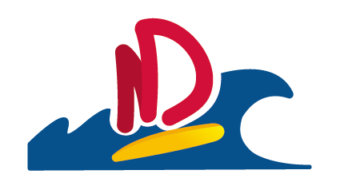

<p align="center">
  
</p>

<h1 align="center">APEL Manager</h1>

<p align="center">
  <strong>Le tableau de bord de l’APEL Notre Dame des Flots.</strong><br />
  Événements, bénévoles, adhérents, comptabilité et documents réunis dans une
  seule application.
</p>

<p align="center">
  
  
  
  
</p>

Application de gestion conçue pour l’**APEL Notre Dame des Flots**, association
enregistrée sous le numéro RNA **W853001441**. Elle centralise le travail de
l’équipe, de la préparation d’un événement jusqu’au suivi administratif et
financier.

## Fonctionnalités

- **Événements et calendrier** — fiches détaillées, export iCalendar, modèles
  réutilisables et inscriptions publiques des bénévoles.
- **Check-lists opérationnelles** — échéances relatives en jours, semaines ou
  mois, responsables, descriptions mises en forme et réorganisation par
  glisser-déposer.
- **Membres et adhérents** — rôles administrateur, organisateur et membre,
  coordonnées, année scolaire, statut et suivi des cotisations.
- **Comptabilité associative** — recettes, dépenses, comptes, catégories,
  validation des écritures et justificatifs privés.
- **Documents officiels** — procès-verbaux d’AG, attestations et archives avec
  pièces jointes protégées.
- **Communication** — e-mails via Resend ou SMTP, notifications Telegram et
  rappels automatiques des tâches.
- **Intégration Claude.ai** — serveur MCP distant sécurisé par OAuth 2.1 et PKCE
  pour piloter les modules selon les droits du compte.

## Démarrage en une commande

Docker Engine et Docker Compose sont les seuls prérequis :

```bash
git clone https://github.com/flocom/APEL-manager.git
cd APEL-manager
docker compose up --build -d
```

| Service | Adresse locale |
|---|---|
| Application | [http://localhost:3000](http://localhost:3000) |
| Boîte e-mail Mailpit | [http://localhost:8025](http://localhost:8025) |
| État de santé | [http://localhost:3000/api/health](http://localhost:3000/api/health) |

Au premier lancement, les secrets internes sont générés, PostgreSQL est
initialisé et les migrations sont appliquées automatiquement. Le **premier
compte créé** depuis `/register` devient administrateur.

Les données restent conservées après un `docker compose down`. Pour arrêter la
stack :

```bash
docker compose down
```

## Stack Docker complète

| Conteneur | Rôle |
|---|---|
| `app` | Application Next.js 15 et migrations Drizzle |
| `db` | PostgreSQL 16 avec stockage persistant |
| `scheduler` | Rappels quotidiens et nettoyage des imports abandonnés |
| `mailpit` | Serveur SMTP local et boîte de contrôle |
| `caddy` | Reverse proxy HTTP/HTTPS et certificats TLS automatiques |

Des volumes dédiés conservent la base, les pièces jointes, les secrets générés,
les e-mails locaux et les certificats. La procédure de configuration, de
sauvegarde et de mise en production est détaillée dans
[`docs/DOCKER.md`](docs/DOCKER.md).

## Mise en production

Créez un fichier `.env.docker` hors versionnement, puis démarrez l’instance avec
ses paramètres :

```bash
docker compose --env-file .env.docker up --build -d
```

Caddy peut obtenir automatiquement un certificat TLS dès qu’un domaine public
pointe vers le serveur. Pour les envois réels, configurez **Resend** depuis le
tableau de bord ou un relais **SMTP** externe ; Mailpit capture uniquement les
messages en local.

Claude.ai doit joindre une URL HTTPS publique. Le connecteur personnalisé
utilise alors l’adresse :

```text
https://votre-domaine.fr/api/mcp
```

Consultez [`docs/MCP_CLAUDE.md`](docs/MCP_CLAUDE.md) pour l’authentification et
la connexion du serveur MCP.

## Développement local

```bash
npm ci
cp .env.example .env.local
npm run db:push
npm run dev
```

Renseignez au minimum `DATABASE_URL`, `AUTH_SECRET` et
`SETTINGS_ENCRYPTION_KEY` dans `.env.local`. L’application accepte toute base
PostgreSQL compatible ; le guide Vercel utilise Neon.

## Documentation

- [Déploiement Docker complet](docs/DOCKER.md)
- [Connexion MCP à Claude.ai](docs/MCP_CLAUDE.md)
- [Alternative Vercel + Neon](docs/DEPLOIEMENT.md)
